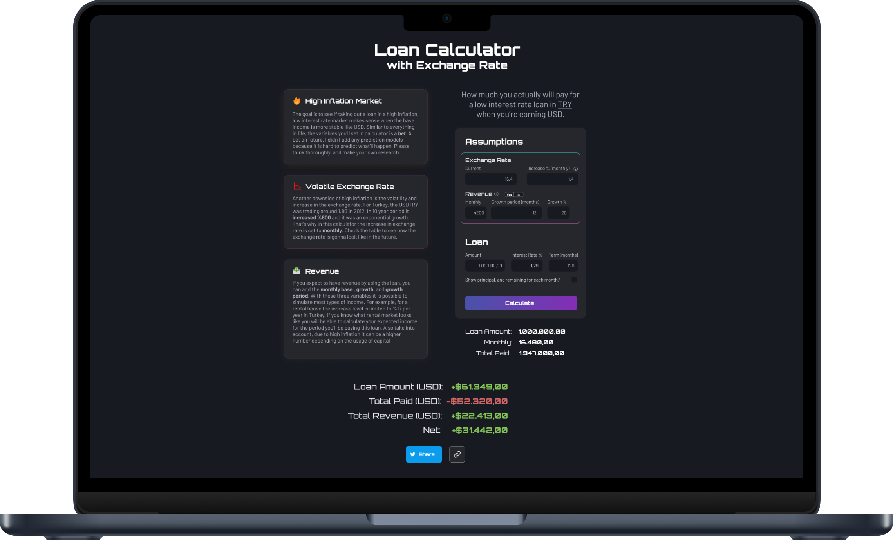

# Loan Calculator with Exchange Rate 💵

This Loan Calculator is built to include the exchange rate, revenue informations to a common loan calculators. If you're from US this might seem really different than the common calculators because it is built for people outside US who are earning USD in a high inflation, low interest rate country. You can find it in [loan-calculator-with-exchange-rate.netlify.app](https://loan-calculator-with-exchange-rate.netlify.app)



An unfortunate example of this is Turkey. Inflation is over 70% and TRY lost more than 50% of its value. To give it a bit more context 1$ was around 8TRY in June '21 and it is now over 17TRY. One of the reasons for this is the low interest rate. The common rate is 1.29 and it is an insane rate that is causing this but as a capitalist I can't ignore that this also introduces a small opportunity.

In the last 10 years USD went from 1.8 to 17 and most of this value loss happened in the last 2 years. While inflation is almost on par with this change for anyone earning USD the amount of monthly installment equivalent will reduce in an exponantial speed. If you act smart and generate revenue as well, you'll basically get free money after a certain month. While that applies to loans in USD as well, the inflation and value loss of TRY will expedite this process.

The mini tools [maybe.co](https://maybe.co) designs inspired the design of this calculator. If you haven't already I would suggest for you to check those out.

## Controls
There are 3 sets of input you need to enter. Loan is basic but the exchange rate and the revenue inputs are grouped under 'assumptions' because they are the important assumptions you'll be making. Please be careful and do a thorough research before making any big decisions. This calculator is mostly a playground for people who like numbers.

## TODOs
Since it solves the problem with its current state there is not critical todos but it would be nice to add a bit more visual flare to it. Any contributions are welcome. Here are some todo items to improve this calculator even further.
- [ ] Improve input number formatting, and validations
- [ ] Add a chart for exchange rate, revenue projections
- [ ] Add sliders to inputs

Do not hesitate to clone the repo and build your own calculator. I would appreciate an attribution and some updates in design to have some differentiating factors.

## Develop
This calculator is built with React and it is really basic in terms of implementation. The code has been commmented to give an ease for other eyes who wants to contribute.

After cloning the repo, run:
```bash
npm install
```

To start the dev server run:
```bash
npm start
```
